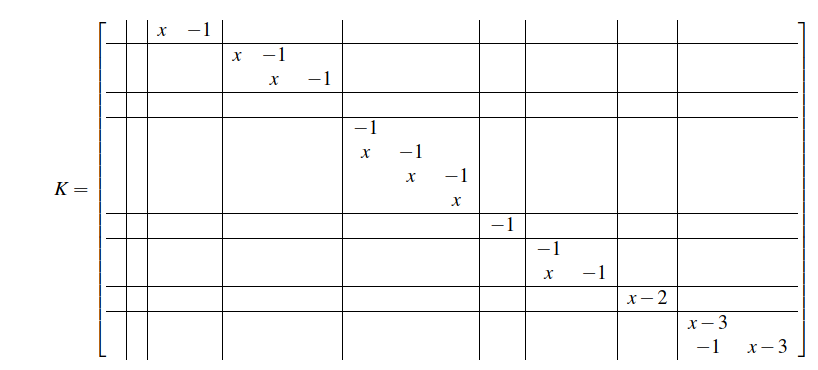

# MatrixPolynomials

| **Pkg Info** |  **Build Status** |
|:------------:|:-----------------:|
|![maturing][version-img] [![license: MIT][mit-img]][mit-url] | [![build status][ci-img]][ci-url] [![coverage][codecov-img]][codecov-url] |


This package has functionalities to compute eigenvalues and row/column indices of polynomial matrices. For matrix pencils (i.e polynomial matrices of degree 1) 
it uses the approach described in [1]. For higher degree polynomial matrices, it computes the companion pencil as described in [2]


## Installation

You can install the package with the following command from the Julia REPL

```julia-repl
julia> using Pkg; Pkg.clone("https://github.com/lucaferranti/MatrixPolynomials.jl")
```

then it can be imported with the command using

```julia-repl
julia> using MatrixPolynomials
```

and you are ready to go.
## Basic usage

First set the variable you want to use

```julia-repl
julia> x = variable("x")
```

then you can use the functions `eig`, `colIndices` and `rowIndices` to compute the eigenvalues (including infinite), column indices and row indices of the polynomial matrix, respectively. For example

```julia-repl
julia> A = [1 0 0;0 x 0;0 0 x^2-x]
3×3 Matrix{Pol{Int64}}:
 1  0  0
 0  x  0
 0  0  x²-x

julia> eig(A)
6-element Vector{Float64}:
  0.0
  0.0
  1.0
 Inf
 Inf
 Inf
```
note that each eigenvalue is displayed as many times as its multiplicity

```julia-repl
julia> A = [x^2 1 0; 0 0 0;0 0 x]
3×3 Matrix{Pol{Int64}}:
 x²  1  0
 0   0  0
 0   0  x

julia> eig(A)
2-element Vector{Float64}:
  0.0
 Inf

julia> colIndices(A)
1-element Vector{Int64}:
 2

julia> rowIndices(A)
1-element Vector{Int64}:
 0
```

Consider the matrix



and let us create a pencil which is similar to it (i.e. it has the same kronecker canonical form)
```julia-repl
julia> F = svd(rand(size(K)...), full=true);

julia> A = F.U*K*F.Vt
14×16 Matrix{Pol{Float64}}:
 -0.0531938456625265x-0.016443026565336638  0.1659990101851725x-0.0752994132628953      …  -0.02836295427348124x-0.08280034702545919   0.08935213842162257x-0.2986610881054999
 -0.1892973258478695x+0.36305021125569603   0.2569299424086135x+0.25614543917284416        0.20883195922953382x-0.08497899519608838    -0.4096605417662274x+0.008211677910084578
 -0.2051009107681339x+0.1338033374425252    -0.22622834296916827x-0.5649730145487936       0.36485531497712875x+0.008334534313154389   0.2586114320979566x-0.10551634010722975
 -0.24391841281649423x+0.05915913446914345  0.08960181136447377x-0.18260047860659928       0.25330527430383004x-0.14363728235715928    -0.010780936837348019x+0.8682744546639493
 0.0706863493767832x-0.40101473357364487    0.030070817624082213x+0.15242476262816174      -0.008644310753408609x-0.22037981378820748  0.2942742424370547x-0.250146281955439
 ⋮                                                                                      ⋱                                              ⋮
 0.24769793065683315x-0.835257666470237     0.15474144869468856x+0.45328057907694497    …  -0.19377305697977892x+0.7757004710333826    0.015370887771973889x-0.005275056565985876
 0.02328379727773061x+0.33673497247414375   -0.11647734336677054x-0.03759805437164008      -0.029572552560713783x-0.19055303243632493  -0.09681679566345053x+0.05059915409452563
 -0.08755702055729038x+0.4818989653785114   0.003173700702295574x+0.35944474195574383      0.06637316636159107x-0.18857038764730866    0.17988140344590528x+0.16414641745121
 -0.5909664792903052x+0.5718523239410791    -0.060467877218732445x-0.09858618028360636     -0.020036751708295546x+0.5032823409219751   0.31850859338078613x-0.015581271200749341

julia> eig(A, 1e-6)
6-element Vector{ComplexF64}:
 2.0000000000000004 + 0.0im
 3.0000000000000004 - 2.8214167391418174e-8im
 3.0000000000000004 + 2.821416739141817e-8im
                Inf + 0.0im
                Inf + 0.0im
                Inf + 0.0im

julia> colIndices(A, 1e-6)
4-element Vector{Int64}:
 0
 0
 1
 2

julia> rowIndices(A, 1e-6)
2-element Vector{Int64}:
 0
 3
```

the second parameter is the tolerance used to compute the rank of the matrix. The algorithms have a heuristic sanity check to detect numerical errors. For example if we had computed

```julia-repl
julia> colIndices(A)
┌ Error: could not compute the column indices. Try using a higher tolerance
└ @ MatrixPolynomials c:\Users\lucaa\OneDrive - University of Vaasa\work\2020\kurssit\matrixTheory\project\MatrixPolynomials\src\eigenvalues\eigenvalues.jl:25
```

the algorithm detects that numerical errors have occured the result is not reliable.

## References

[1] VAN DOOREN, P. (1979) The computation of kronecker’s canonical form of a singular pencil. Linear Algebra and its Applications., 27, 103–140.
[2] DE TERAN, F. E. A. (2014) Spectral equivalence of matrix polynomials and the index sum theorem. Linear Algebra and its Applications, 459, 264 – 333

[version-img]: https://img.shields.io/badge/lifecycle-maturing-blue.svg

[mit-img]: https://img.shields.io/badge/license-MIT-yellow.svg
[mit-url]: https://opensource.org/licenses/MIT

[ci-img]: https://github.com/lucaferranti/MatrixPolynomials.jl/workflows/CI/badge.svg
[ci-url]: https://github.com/lucaferranti/MatrixPolynomials.jl/actions

[codecov-img]: https://codecov.io/gh/lucaferranti/MatrixPolynomials.jl/branch/master/graph/badge.svg
[codecov-url]: https://codecov.io/gh/lucaferranti/MatrixPolynomials.jl
